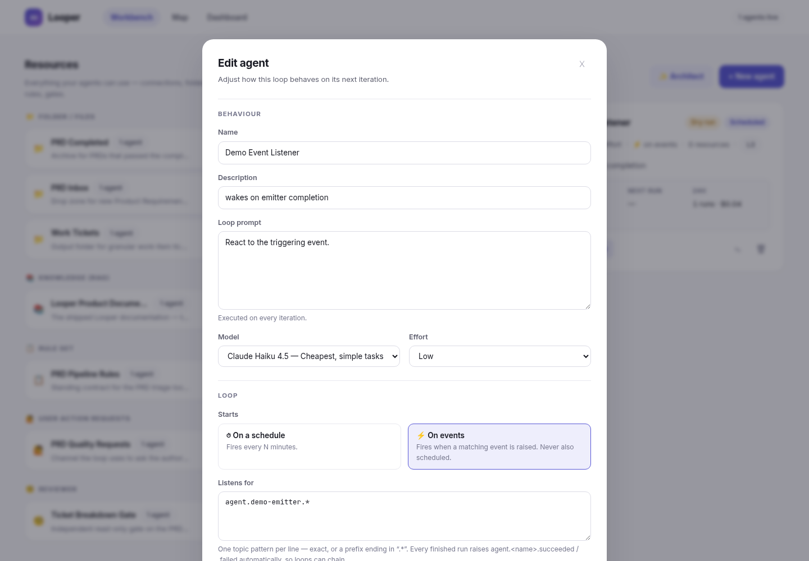
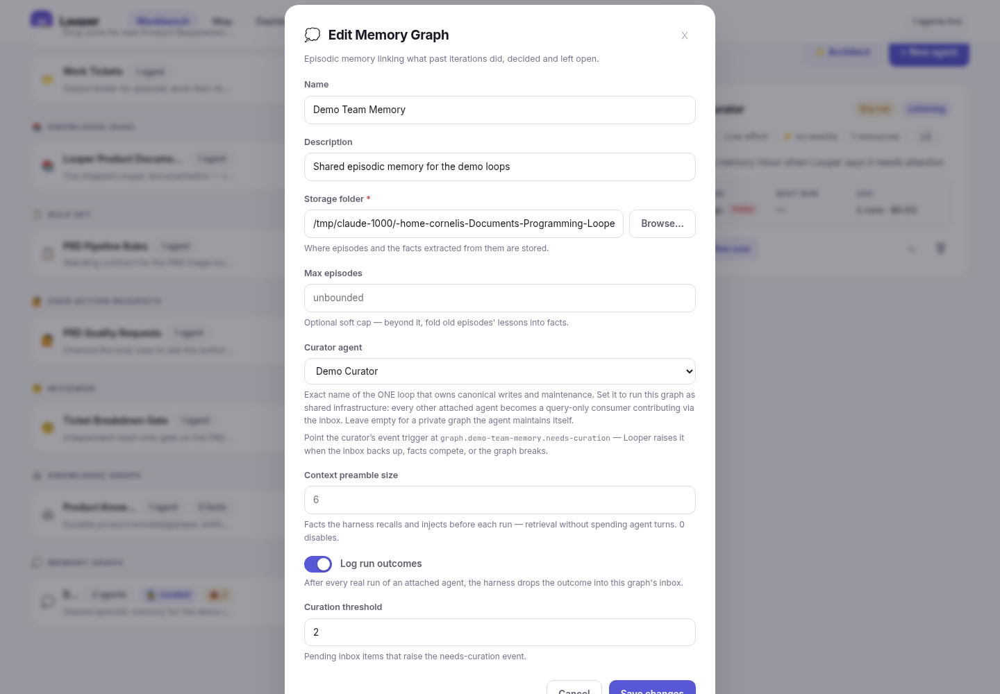
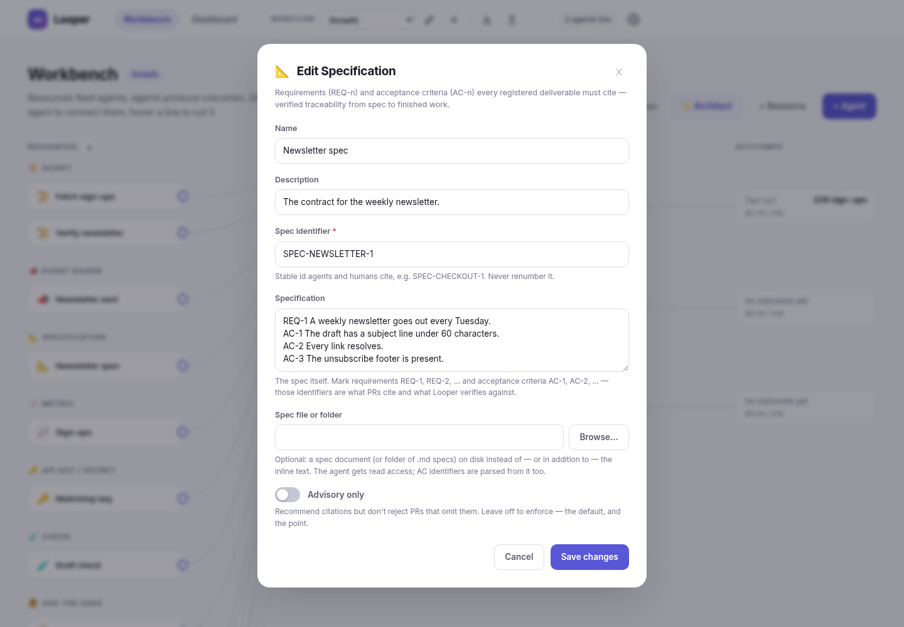

# Looper

**Loop engineering for Claude agents — for any profession.** Define reusable resources — folders, rules, checks, scripts, metrics, credentials, MCP servers — wire them into agents that run on a schedule or on events through the [Claude Agent SDK](https://code.claude.com), and watch cost, reliability and the outcomes you care about on a live dashboard. A marketing loop that drafts and measures a newsletter, a support loop that triages tickets, a research loop that keeps a briefing current, an engineering loop that ships pull requests: same tool, same guarantees. Nothing assumes code; the pull-request delivery metrics are one built-in outcome family for coding loops, folded away until a PR exists.


<p align="center"><em>60-second tour: create a resource, wire it into a scheduled agent, run a loop, inspect its logs and cost, and check the dashboard.&nbsp;&nbsp;(<a href="docs/looper-walkthrough.mp4">full-resolution video</a>)</em></p>

## Highlights

- **Loops, not chats** — an agent is a prompt plus a cadence: pick the model and effort level (`low → max`), cap turns and per-run spend, and let the scheduler fire it. Every iteration records real cost, tokens, duration and logs.
- **Memory that survives the loop — decoupled from the loops that use it.** Four shipped graph resources (continuous vector memory, knowledge, episodic memory, execution graphs) give agents persistent state on disk. Set a **curator** on a graph and it becomes shared infrastructure with separated concerns: executing loops are *consumers* (query-only tool access, an automatic **memory-context preamble** the harness retrieves deterministically before each run, and an append-only **inbox** to contribute learnings to), while ONE dedicated curator loop owns canonical writes — merging the inbox, resolving competing facts, superseding what changed. A background janitor measures every graph's **health** (inbox depth, competing facts, structural problems), persists the snapshot, and raises `graph.<name>.needs-curation` so the curator wakes *only when there's work* — and the harness can log each run's outcome into the inbox by itself, so episodic memory costs zero agent tokens. Mutations take a file lock, recalls log usage telemetry, and `decay` mechanically down-weights facts nobody uses. No curator = a private graph the agent maintains itself, exactly as before.
- **Dry-run first** — new agents rehearse with a simulated executor that produces realistic cost numbers without spending a token. Flip the switch when the loop earns it.
- **Resources are modular** — and you can mint new resource types *inside the app*: describe a capability and Claude writes the C# module, Roslyn compiles it, and it loads live. No restart.
- **An in-app architect** — describe a whole workflow (`✨ Architect` on the workbench) and an AI builds it through Looper's own API: reusing suitable resources from your pool, creating what's missing (rule sets, reviewers, testing gates, workspace pools, agents), and wiring them together. Its toolset is curl-only and additive-only, every agent it creates starts dry-run and paused at low autonomy, and what it built is reported by diffing the workspace — not by trusting its own account.
- **Event-driven loops** — an agent starts **on a schedule *or* on events, never both**. Event agents declare topic patterns they listen for (`prd.approved`, or a prefix like `agent.docs-gardener.*`); anything can raise an event — a run (via a curl protocol injected into every real run), the harness (every finished run automatically announces `agent.<name>.succeeded` / `.failed`), or you (`POST /api/events`). Matching is deterministic — exact topic or trailing-`.*` prefix, no regex, no AI in the loop — deliveries are recorded per listener, triggering runs carry the event(s) in their prompt, agents can never trigger themselves, and a chain-depth brake (5) stops runaway loops.
- **A dashboard your product owner can read** — spend over time, cost by agent and by model, success rate, run times, recent failures.
- **Fails closed, never silently** — a run is *Succeeded* only when the model finished **and** every gate passed. Everything else is an honest failure with a reason on the run: the CLI stopping at the turn or budget cap (`error_max_turns` / `error_max_budget`), a run that ends without reporting anything, a resource that cannot be applied (the run is not even started, no tokens spent), a testing action with no command, a script with no code, a reviewer with no rubric, a reviewer whose verdict cannot be parsed, a failed before-run script, a failed after-run gate. Completion events (`agent.<name>.succeeded` / `.failed`) carry the same honest verdict, so chained loops never build on a false positive; `@metric` lines survive output truncation so measurements are never lost to a chatty script.
- **Subscription or API key — your choice, applied deterministically** — ⚙ Settings in the topbar decides what the Claude Code CLI signs in with: the **Claude Code subscription** login on the API machine (the default) or an **Anthropic API key** stored in Looper. The choice is applied to every launch — agent runs, reviewers, script assists, module builds, the Architect — by setting `ANTHROPIC_API_KEY` for the child process in key mode and *stripping* an inherited one in subscription mode, so what the setting says is what gets billed. The run log records which was used (`auth=API key (…a1b2)` / `auth=Claude Code subscription`); the key is write-only through the API (only its last characters come back); and choosing key mode without a key is refused at save time and, if the row ever went missing, fails the run before the CLI starts.
- **Workflows** — a workflow is one workbench: its own resources, agents and metrics, wired for one purpose. Everything that existed before workflows lives in the seeded **Default** workflow; create more from the topbar switcher (+), rename or delete them (✎ — deleting takes the agents, runs and resources with it; the default stays). The selection is global and remembered: the workbench shows that workflow, new items land in it, the Architect builds inside it, and a workflow is a closed set — agents only attach resources from their own. The dashboard filters every section by workflow (defaulting to the selected one, widenable to all). Events cross workflows, so loops in different ones can still chain.
- **The workbench is a live map** — one page draws the whole workspace as a graph: resources (grouped by type) flow into agents, agents flow into delivery — and everything is editable in place. Drag a resource's ○ port onto an agent to wire it in, hover an edge and click ✕ to cut it, run / pause / edit / delete agents and resources right on their nodes. Hover anything to trace its links, running agents animate their edges, unused resources render dashed. Deterministic layered layout with barycenter ordering — no physics, no jitter.
- **Scripts: the deterministic half of a loop** — a **Script** resource is runnable Python/Bash you write in-app (or have Claude write, with a ▶ Run button to prove it works). Attach it to an agent and Looper runs it *before* every iteration (its output becomes prompt context) or *after* every iteration (a token-free gate) — always the harness, never the model's choice. The Architect can write them too.
- **Events as resources, deterministic end to end** — an **Event Raiser** attached to an agent makes Looper raise a named event when the run ends the way it says (succeeded / failed / always), with a templated payload; an **Event Listener** attached to an agent wakes it whenever a matching event is raised, in any trigger mode. Topics are picked from a live catalog (every agent's completion events, every raiser and listener, memory-curation events, whatever crossed the bus) or created in place with the same validation the API applies. The workbench draws every raiser→listener chain as an arc between the agents.
- **Spec-to-PR traceability, enforced** — a **Specification** resource carries the contract of record as stable `SPEC`/`REQ-n`/`AC-n` identifiers (inline text and/or a document on disk). Attach it to an agent and every PR that agent registers **must cite the acceptance criteria it satisfies** (`"satisfies":"AC-1,AC-3"`); Looper verifies the citations against the spec at registration time and rejects what doesn't trace — uncited PRs and invented criteria alike, with the valid vocabulary in the error. Work that matches no AC is a spec gap the agent must raise, not paper over. Citations are stored on the PR and shown in the delivery table, so "what shipped" always answers "against which requirement".
- **Metrics you define** — pull requests are only one kind of result. A **Metric** resource names any outcome a loop is meant to move (campaign sign-ups, conversion rate, ticket resolution time, revenue, defect count), says how values combine (a gauge, a running total, an average) and which way is good, and optionally sets a target. Attach it to the agents that affect it and they get a reporting protocol; a Script resource reports by printing `@metric name=value`; you can add values by hand. Every metric appears on the dashboard the moment it exists — current reading, direction-aware trend against the previous period, target progress, a sparkline, and every measurement with who reported it and why. The workbench's third column shows each agent's outcomes. The Architect creates metrics for the outcome a workflow is meant to move.
- **Delivery metrics that measure value that stuck** (the built-in outcome family for coding loops; folded away on the dashboard until a pull request exists) — output volume is meaningless when agents can generate unlimited plausible work, so Looper tracks the five that survived: **cost per merged PR** (does spend convert into shipped work?), **first-pass success rate** (or are humans quietly fixing everything?), **code survival rate** (measured by `git blame` after a 14-day window — does agent output last?), **review churn per unit of change** (did "faster to produce" become "slower to accept"?), and **escalation rate** (are autonomy levels set correctly?). Agents report their PRs and escalations through a protocol injected into every real run; GitHub-hosted PRs stay fresh via `gh`; each agent carries an explicit **autonomy level (L1–L4)** with promote/demote recommendations computed from the evidence.

| Workbench | Agent editor |
|---|---|
|  |  |

| Run detail | Dashboard |
|---|---|
|  |  |

## How it works

**Resources (left column)** are capabilities agents can be granted. Wire one into an agent by dragging its port onto the agent (or `POST /api/agents/{id}/resources/{resourceId}`); cut the edge with ✕ (or `DELETE` the same route). At run time they translate into Claude Code CLI flags and environment:

| Type | What it becomes at run time |
|---|---|
| MCP Server | `--mcp-config` entry (stdio/http/sse) |
| Folder / Files | working directory (primary) or `--add-dir` — pick it with the built-in folder browser |
| Rule | appended to the system prompt |
| Rule Set | a managed collection of rules with per-rule toggles; enabled rules join the system prompt in order |
| Ask the user | a **tool**, not a question: lets the agent raise a User Action Request for anything only *you* can do or decide — raising one is **not a failure**: the run finishes cleanly and the schedule parks until you complete it (Run now is gated too). Surfaced in the topbar ("🙋 N waiting on you"), on agent nodes, and as a completion panel on the agent page. Completing is a **deterministic edit, never hidden context**: every iteration starts clean, so your answer is recorded as a standing rule in the agent's own "<agent> decisions" rule set (loaded into every run's system prompt), dropped into its memory graph's inbox, or recorded nowhere — the agent then verifies the state itself and raises a new request if something is still missing |
| Dynamic Workspaces | a pool agents claim **a dedicated workspace per unit of work** from, mid-run (idempotent by unit name, so iterations resume where the last left off): provisioned blank, as a shallow git clone, or from a template folder, seeded with a `WORKBRIEF.md` carrying the passed context and a handoff protocol. Mark units done from the run or the UI; a janitor removes done workspaces after the retention window |
| Knowledge (RAG) | knowledge-source instructions in the prompt (+ folder access) |
| Check (testing action) | a command executed after every iteration — a test suite, a validator, a link checker; non-zero exit fails the run |
| Sub-agent | `--agents` definition the main agent can delegate to |
| Reviewer | an **independent review gate** after every loop: a fresh-context reviewer (read-only tools, its own model) judges the work against a rubric; failures loop fix instructions back through the worker up to N rounds, then fail the run — optionally escalating to a human. Deliberately not a sub-agent: the worker must not control its own gate |
| API key / secret · Azure Connection | environment variables injected into the run (stored masked) |
| Metric | a user-defined outcome: `{unit, aggregation: latest\|sum\|average, direction: higher\|lower, target?, instructions?}`. Attached agents get the reporting protocol (`POST /api/metrics/values` with `$LOOPER_RUN_ID`, the id in `$LOOPER_METRIC_<NAME>`); scripts report with `@metric <name>=<number> <note>` lines (recorded from before- and after-run stages, the latter from the final gate run only); `GET /api/metrics?days=N` summarizes every metric for the dashboard, `GET /api/metrics/{id}/values` lists the measurements, `DELETE /api/metrics/values/{id}` removes one |
| Specification | the spec (with `REQ-n`/`AC-n` identifiers) is injected into the prompt along with the parsed AC inventory and the citation mandate; the PR-registration endpoint then **rejects** any PR from the agent that doesn't cite valid acceptance criteria (set "advisory" to recommend instead of reject). A spec file/folder on disk gets `--add-dir` + `$LOOPER_SPEC_PATH` |
| Script | a **runnable Python or Bash script** kept as a resource. Write it in a code editor, or ask Claude inside the editor to write/update it (Claude edits a scratch copy, may run it to verify, and the file it leaves behind is the proposal — nothing is saved until you click save); test it with ▶ Run before any agent depends on it. It always runs deterministically, by Looper: **before** — before every iteration, stdout injected as a `SCRIPT OUTPUT` prompt section (a failure aborts the iteration before any tokens are spent); **after** — after every iteration as a gate alongside testing actions (non-zero exit fails the gate, re-run on review fix rounds). The agent also gets the path (`$LOOPER_SCRIPT_<NAME>`) so it can re-run a gate before finishing. Scripts see `LOOPER_API_URL`/`LOOPER_RUN_ID`/`LOOPER_AGENT_ID` and the agent's credential env vars |
| Event Raiser | `{topic, when: succeeded\|failed\|always, payload?}` — after the attached agent's run, the harness raises `topic` when the outcome matches (`succeeded` = run ok and every gate passed); `payload` may use `{agent}`, `{run}`, `{status}`, `{result}`. Bad topics are rejected at save time |
| Event Listener | `{topic}` — an exact topic or a `prefix.*` pattern; the dispatcher wakes the attached agent whenever a matching event is raised, whatever its trigger mode (an event-mode agent may rely on listeners alone). `GET /api/events/topics` is the catalog the pickers read |
| Vector / Knowledge / Memory / Execution graphs | a persistent graph workspace: on creation Looper seeds it with `loopergraph.py` (a self-contained CLI enforcing typed edges from a controlled ontology, bi-temporal invalidate-never-delete, vector-entry recall, a validated execution DAG — plus advisory file locking, a per-file contribution inbox, usage telemetry, a `health` report and mechanical `decay`), a starter ontology and a protocol README; runs get `--add-dir`, a `LOOPER_*_PATH` env var and a **role-aware** protocol in the prompt: consumers of a curated graph get query commands + `remember` (inbox) and an explicit write prohibition, the curator gets the full merge/resolve/decay protocol, and an uncurated graph keeps the classic self-maintained protocol. Memory graphs also inject a harness-retrieved MEMORY CONTEXT preamble (`preambleK` facts, zero agent turns) and can auto-log run outcomes into the inbox (`autoLog`). `GET /api/graphs` serves each graph's wiring + last health snapshot |
| **Custom (AI-generated)** | anything a module contributes: env vars, rules, prompt sections, MCP servers, directories |

**Agents (center column)** run their loop prompt with the chosen model, effort level, turn cap, per-run budget cap (`--max-budget-usd`) and resource set — woken either every *N* minutes or by a matching event (one trigger mode per agent, enforced).

<p align="center"></p>

**The production memory pattern** — one shared graph, many loops, one curator: create a memory graph, pick a **curator agent** in its editor, and attach the graph to every loop that should share the memory. Consumers query and contribute to the inbox; the harness injects each run's memory preamble and logs outcomes; the janitor raises `graph.<name>.needs-curation` when the inbox hits its threshold, facts compete, or validation fails — and the event-triggered curator wakes, merges, and goes back to sleep. The ✨ Architect knows this pattern and can wire the whole thing from one prompt.

<p align="center"></p>

<p align="center"></p>

**Dynamic resource types** — in the resource picker, choose **“New type, written by Claude”** and describe a capability (e.g. *“a Postgres connection exposed as PG\* env vars”*). Claude writes a C# module implementing `IResourceTypeModule`, Roslyn compiles it in-process, and every compiler error goes straight back to Claude for another attempt — up to `Looper:ModuleGenerationMaxAttempts` (default 4), with the attempt and the errors shown live and a **Cancel generation** button that kills the run; nothing is installed unless it compiled and loaded. Then the DLL loads live — the new type appears in the picker immediately, its form is rendered from the module's field specs, and `Password` fields are masked like built-in secrets. Modules are stored (source + DLL) in the `modules/` folder next to the API and reloaded — recompiled from source if the DLL is missing — at startup. Power users can also `POST /api/resource-types` with raw module source.

<p align="center"></p>

## Requirements

- .NET SDK 10, Node.js 22
- For **real** (non-dry-run) loops: [Claude Code](https://code.claude.com) installed and authenticated. If it's missing, the app shows a setup banner with one-click install (`POST /api/system/install-claude` runs the official installer) — after installing, run `claude` once in a terminal to sign in.

## Run it

```bash
./dev.sh            # starts API (http://localhost:5210) + Angular (http://localhost:4200)
```

or manually:

```bash
cd api && dotnet run --project Looper.Api      # API on :5210
cd web && npm start                             # UI on :4200
```

The app starts with an empty workspace — create resources in the left panel, then wire them into your first agent. The SQLite database lives next to the API working directory (`looper.db`); delete it for a clean slate.

Real runs need the Claude Code CLI signed in (`claude` once in a terminal) **or** an Anthropic API key pasted under ⚙ Settings → Claude credentials (`GET`/`PUT /api/settings`). Subscription is the default.

## Tests

```bash
cd api && dotnet test                                              # 42 tests: unit + full HTTP integration
cd web && CHROME_BIN=$(which google-chrome) npx ng test --watch=false --browsers=ChromeHeadless
```

Backend tests cover the CQRS decorator pipeline, secret masking (including dynamic-module password fields), the Roslyn module compiler and loader, Claude CLI output parsing and status probing, the folder-browse endpoint, the run coordinator (dry-run lifecycle, double-trigger rejection, cancellation), and integration tests that boot the real API on a throwaway SQLite file: resource lifecycle with secret preservation, dynamic type install → use → in-use protection → removal, agent lifecycle with a real (simulated) run, and dashboard aggregation.

## Architecture

- **`api/`** — .NET 10 minimal API. CQRS with the decorator pattern (Scrutor): every command flows through `Logging → Validation → Handler`; queries through `Logging → Handler`. Features are organized as **vertical slices** (`Features/Resources`, `Features/Agents`, `Features/Runs`, `Features/Dashboard`, `Features/ResourceTypes`, …) — one file per use case containing command/query, validator, handler and endpoint. EF Core + SQLite for persistence. A background `AgentSchedulerService` fires due agents; `AgentRunCoordinator` enforces one active run per agent and a global concurrency cap; `ClaudeCliExecutor` drives the Claude Agent SDK headlessly and parses cost/usage from its JSON output.
- **`web/`** — Angular 20 (standalone components, signals, new control flow). Workbench (the live architecture map: resources → agents → delivery, editable in place, drag-to-wire), agent detail with live logs, dashboard with hand-rolled SVG charts.

## Security notes

- Secrets (PAT tokens, client secrets, the optional Anthropic API key from Settings) are stored in the local SQLite database and **masked in every API response**; they are only decrypted into the environment of a spawned run. Treat `looper.db` accordingly.
- Agents default to full autonomy (`bypassPermissions`) inside their configured working directory — scope their folder resources deliberately.
- The folder browser (`GET /api/filesystem/directories`) enumerates directory **names** on the machine running the API so the UI can offer a real picker. It never reads file contents, and the API binds to localhost only. Don't expose the API on a public interface.
