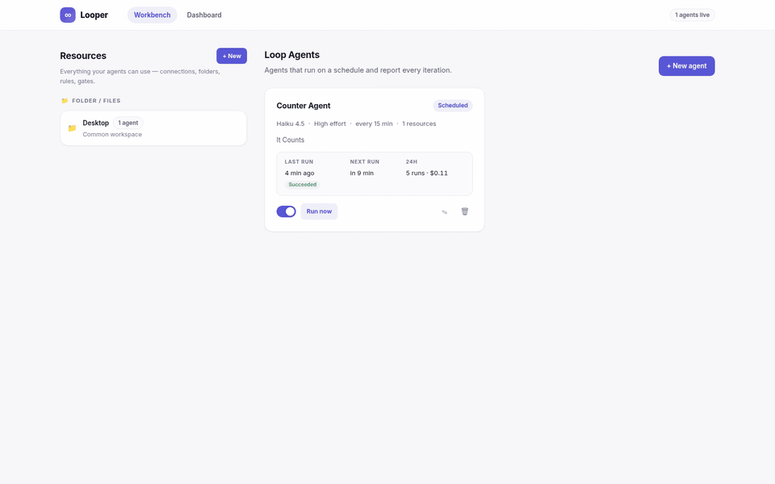
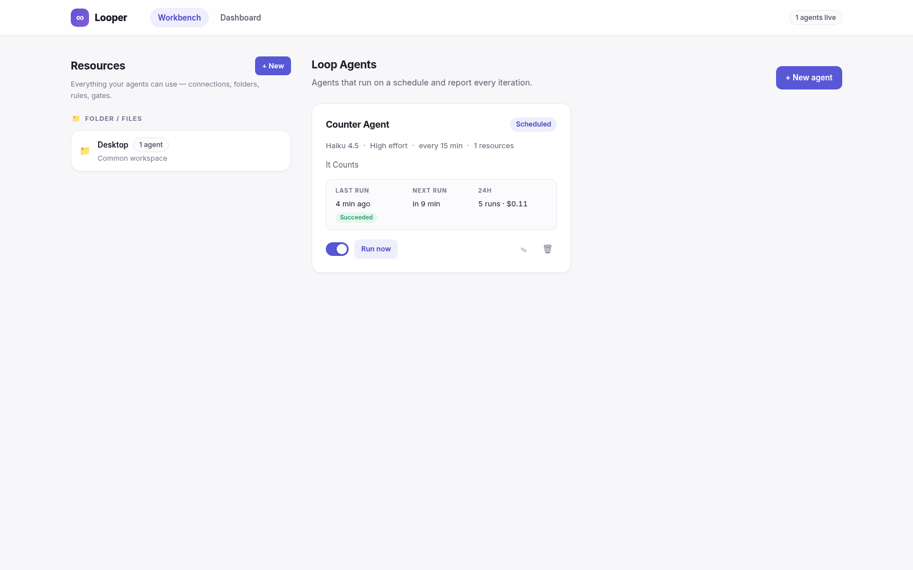
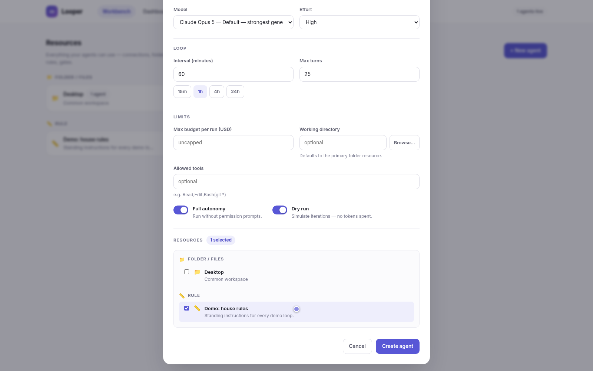
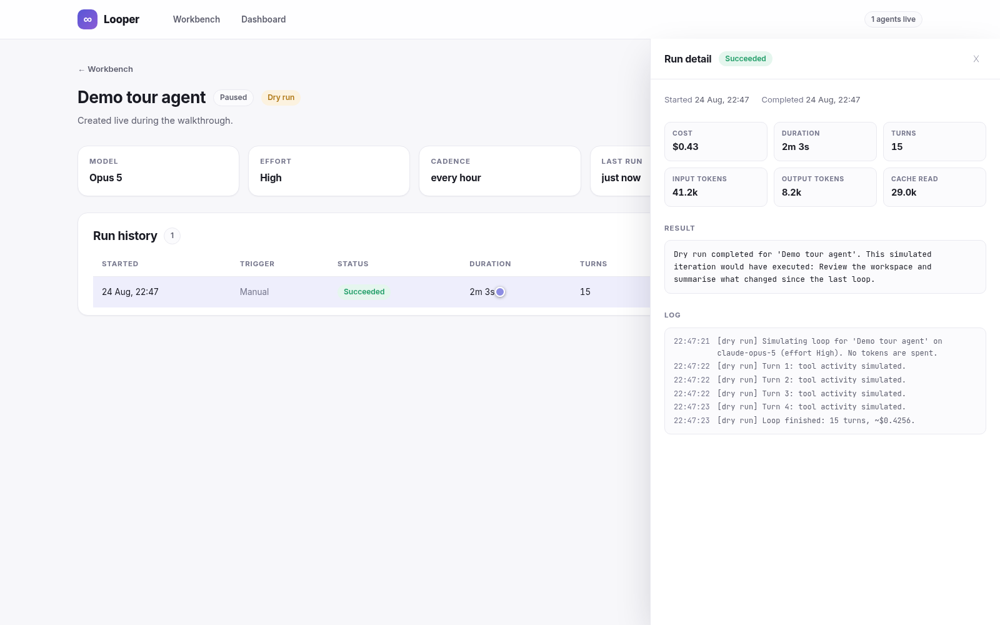
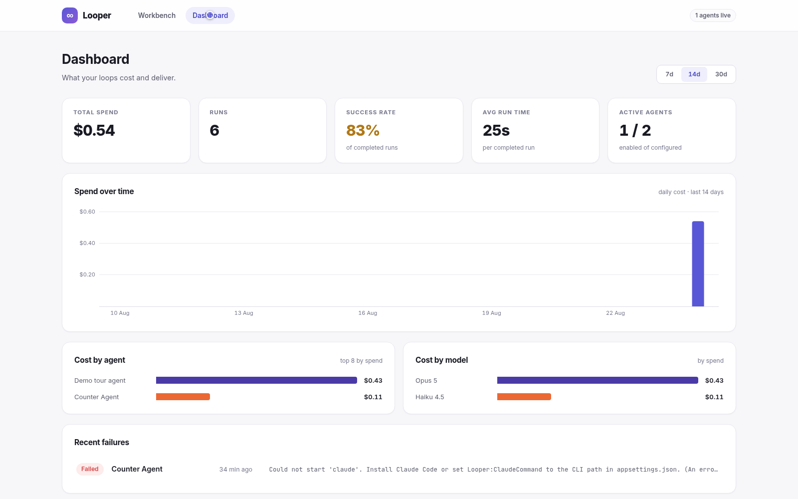
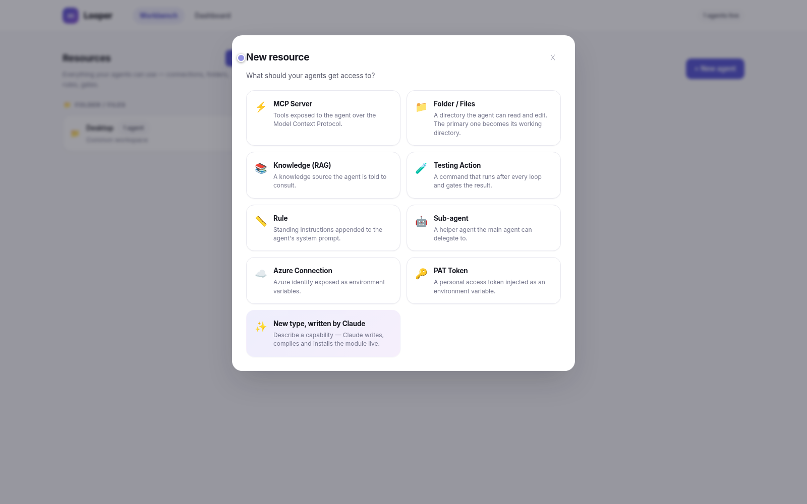

# Looper

**Loop engineering for Claude agents.** Define reusable resources — MCP servers, folders, rules, testing gates, credentials — wire them into agents that run on a schedule through the [Claude Agent SDK](https://code.claude.com), and watch cost, reliability and output on a live dashboard.



<p align="center"><em>60-second tour: create a resource, wire it into a scheduled agent, run a loop, inspect its logs and cost, and check the dashboard.&nbsp;&nbsp;(<a href="docs/looper-walkthrough.mp4">full-resolution video</a>)</em></p>

## Highlights

- **Loops, not chats** — an agent is a prompt plus a cadence: pick the model and effort level (`low → max`), cap turns and per-run spend, and let the scheduler fire it. Every iteration records real cost, tokens, duration and logs.
- **Dry-run first** — new agents rehearse with a simulated executor that produces realistic cost numbers without spending a token. Flip the switch when the loop earns it.
- **Resources are modular** — and you can mint new resource types *inside the app*: describe a capability and Claude writes the C# module, Roslyn compiles it, and it loads live. No restart.
- **A dashboard your product owner can read** — spend over time, cost by agent and by model, success rate, run times, recent failures.

| Workbench | Agent editor |
|---|---|
|  |  |

| Run detail | Dashboard |
|---|---|
|  |  |

## How it works

**Resources (left panel)** are capabilities agents can be granted. At run time they translate into Claude Code CLI flags and environment:

| Type | What it becomes at run time |
|---|---|
| MCP Server | `--mcp-config` entry (stdio/http/sse) |
| Folder / Files | working directory (primary) or `--add-dir` — pick it with the built-in folder browser |
| Rule | appended to the system prompt |
| Knowledge (RAG) | knowledge-source instructions in the prompt (+ folder access) |
| Testing Action | shell command executed after every loop; non-zero exit fails the gate |
| Sub-agent | `--agents` definition the main agent can delegate to |
| PAT Token / Azure Connection | environment variables injected into the run (stored masked) |
| **Custom (AI-generated)** | anything a module contributes: env vars, rules, prompt sections, MCP servers, directories |

**Agents (right panel)** run their loop prompt every *N* minutes with the chosen model, effort level, turn cap, per-run budget cap (`--max-budget-usd`) and resource set.

**Dynamic resource types** — in the resource picker, choose **“New type, written by Claude”** and describe a capability (e.g. *“a Postgres connection exposed as PG\* env vars”*). Claude writes a C# module implementing `IResourceTypeModule`, Roslyn compiles it in-process (with one automatic self-repair round on compiler errors), and the DLL loads live — the new type appears in the picker immediately, its form is rendered from the module's field specs, and `Password` fields are masked like built-in secrets. Modules are stored (source + DLL) in the `modules/` folder next to the API and reloaded — recompiled from source if the DLL is missing — at startup. Power users can also `POST /api/resource-types` with raw module source.

<p align="center"></p>

## Requirements

- .NET SDK 10, Node.js 22
- For **real** (non-dry-run) loops: [Claude Code](https://code.claude.com) installed and authenticated. If it's missing, the app shows a setup banner with one-click install (`POST /api/system/install-claude` runs the official installer) — after installing, run `claude` once in a terminal to sign in.

## Run it

```bash
./dev.sh            # starts API (http://localhost:5210) + Angular (http://localhost:4200)
```

or manually:

```bash
cd api && dotnet run --project Looper.Api      # API on :5210
cd web && npm start                             # UI on :4200
```

The app starts with an empty workspace — create resources in the left panel, then wire them into your first agent. The SQLite database lives next to the API working directory (`looper.db`); delete it for a clean slate.

## Tests

```bash
cd api && dotnet test                                              # 42 tests: unit + full HTTP integration
cd web && CHROME_BIN=$(which google-chrome) npx ng test --watch=false --browsers=ChromeHeadless
```

Backend tests cover the CQRS decorator pipeline, secret masking (including dynamic-module password fields), the Roslyn module compiler and loader, Claude CLI output parsing and status probing, the folder-browse endpoint, the run coordinator (dry-run lifecycle, double-trigger rejection, cancellation), and integration tests that boot the real API on a throwaway SQLite file: resource lifecycle with secret preservation, dynamic type install → use → in-use protection → removal, agent lifecycle with a real (simulated) run, and dashboard aggregation.

## Architecture

- **`api/`** — .NET 10 minimal API. CQRS with the decorator pattern (Scrutor): every command flows through `Logging → Validation → Handler`; queries through `Logging → Handler`. Features are organized as **vertical slices** (`Features/Resources`, `Features/Agents`, `Features/Runs`, `Features/Dashboard`, `Features/ResourceTypes`, …) — one file per use case containing command/query, validator, handler and endpoint. EF Core + SQLite for persistence. A background `AgentSchedulerService` fires due agents; `AgentRunCoordinator` enforces one active run per agent and a global concurrency cap; `ClaudeCliExecutor` drives the Claude Agent SDK headlessly and parses cost/usage from its JSON output.
- **`web/`** — Angular 20 (standalone components, signals, new control flow). Workbench (resources ⟷ agents), agent detail with live logs, dashboard with hand-rolled SVG charts.

## Security notes

- Secrets (PAT tokens, client secrets) are stored in the local SQLite database and **masked in every API response**; they are only decrypted into the environment of a spawned run. Treat `looper.db` accordingly.
- Agents default to full autonomy (`bypassPermissions`) inside their configured working directory — scope their folder resources deliberately.
- The folder browser (`GET /api/filesystem/directories`) enumerates directory **names** on the machine running the API so the UI can offer a real picker. It never reads file contents, and the API binds to localhost only. Don't expose the API on a public interface.
